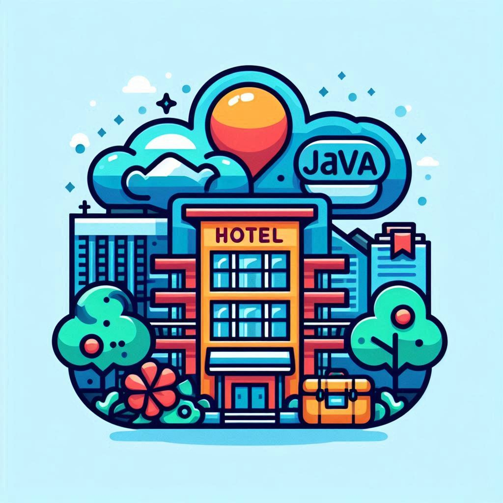

# HOTEL DAM - G1

    

## Descripción del Proyecto

Este proyecto es un aplicativo web para la gestión de un hotel, con dos tipos de usuarios: administrador y usuario.

## Requisitos Previos

- Tener instalados Docker, IntelliJ, PostMan, MySQL, Figma.
- La base de datos se proporciona ya creada con el script.

### Servicios HTTP (M06)

- Páginas dinámicas que permiten a los usuarios apuntarse a servicios del hotel, registrarse, reservar habitaciones,
  etc.

### Interfaz Gráfica (M07)

- Programación de una página dinámica en JSP.
- Utilización de componentes y librerías web.
- Diseño del aplicativo web (wireframes y mockups + prototipo).

### Documentación (M07)

- Documentación en lenguaje de marcado ligero.
- Memoria descriptiva de los pasos seguidos y los diseños realizados.
- Estudio de usabilidad.

## Metodologías

- **Pair programming** en algunas sesiones puntuales.
- Reuniones de una a dos veces por semana con el profesor tutor del grupo para evaluación y planificación.

## Defensa

- Presentación y defensa del aplicativo. Se permite cualquier forma creativa (publicidad, vídeo, presentación
  teatralizada, etc.).

## Pruebas de Validación (Todos)

- Tests y pruebas prácticas de validación de cada una de las unidades formativas trabajadas, con resultado APTO o NO o no
  APTO.
- Una vez que todas las pruebas de validación son APTOS, el alumno obtiene la nota correspondiente al proyecto.
- Los alumnos NO APTOS deben repetir y realizar la prueba de validación de recuperación, demostrando que han adquirido
  los conocimientos.

- - -

### Sprint 1 - Configuración inicial 🚀

### Sprint 2 - Persistencia 🔭

### Sprint 3 - Interficie de usuario 💻

### Sprint 4 - Documentación 📚

    

